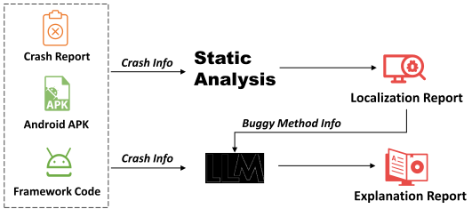
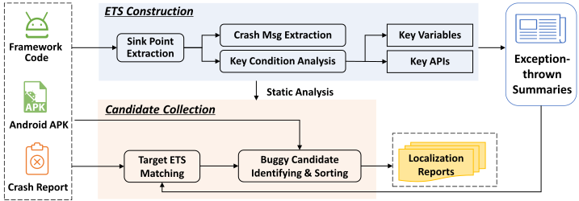
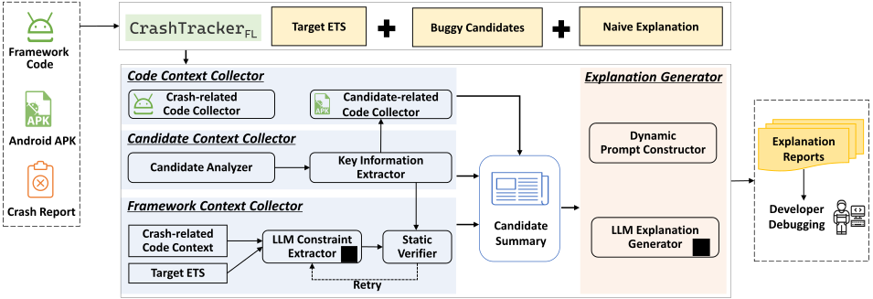

# CrashTracker

## Paper Information

> **Better Debugging: Combining Static Analysis and LLMs for Explainable Crashing Fault Localization**

**Paper Link:** [arXiv](https://arxiv.org/abs/2408.12070)

**Abstract:**

> Nowadays, many applications do not exist independently but rely on various frameworks or libraries. The frequent evolution and the complex implementation of framework APIs induce many unexpected post-release crashes. Starting from the crash stack traces, existing approaches either perform direct call graph (CG) tracing or construct datasets with similar crash-fixing records to locate buggy methods. However, these approaches are limited by the completeness of CG or dependent on historical fixing records. Moreover, they fail to explain the buggy candidates by revealing their relationship with the crashing point, which decreases the efficiency of user debugging. 
> 
> To fill the gap, we propose an explainable crashing fault localization approach by combining static analysis and LLM techniques. Our primary insight is that understanding the semantics of exception-throwing statements in the framework code can help find and apprehend the buggy methods in the application code. Based on this idea, first, we design the *exception-thrown summary* (ETS) that describes the key elements related to each framework-specific exception and extract ETSs by performing static analysis.
> As each crash can map to a target ETS, we make data-tracking of its key elements to identify and sort buggy candidates for the given crash. Then, we introduce LLMs to improve the explainability of the localization results. To construct effective LLM prompts, we design the *candidate information summary* (CIS) that describes multiple types of explanation-related contexts and then extract CISs via static analysis. Compared to SOTA fault localization works, our approach does not solely depend on CG tracing and does not require prior knowledge. Instead, it fully utilizes the information from the framework code and is the first to consider the explainability of the localization results. 
> Finally, we apply our approach to one typical scenario, i.e., locating Android framework-specific crashing faults, and implement a tool called CrashTracker. For fault localization, CrashTracker exhibited an overall MRR value of 0.91 and outperformed the SOTA tool Anchor in precision. For fault explanation, compared to the naive one produced by static analysis only, the LLM-powered explanation achieved a 67.04\% improvement in users' satisfaction score.

**Keywords:**

> Crash Debugging, Fault Localization, Static Analysis, Large Language Model, Android Application

**Evaluation Data**

For RQ1 and RQ2 in the paper, please refer to project [CrashTracker-ArtifactForICSE](https://github.com/hanada31/CrashTracker-ArtifactForICSE).

For RQ3 in the paper, please refer to [release](https://github.com/hanada31/CrashTracker/releases/tag/v2.0.0).

**Tool Overview**



CrashTracker consists of two modules: the FaultLocalization module and the ExplanationGenerator module.





## Tool Usage

### Requirements

1. Python 3.8(with packages in requirements.txt)
2. OpenJDK 17
3. Pandoc 3.3

The tool are developed and tested on Ubuntu. If you are not running the tool on a Unix-like system, you may need do some extra work to make it work.

### Quick Started

You can download the [quick start demo](https://github.com/hanada31/CrashTracker/releases/tag/v2.0.0) in the release page. We provided three example apk files as input and out-of-the-box `references` directory which include pre-built ETS, Android framework code, stubs, apk code and crash information.

```shell
# Decompress the quick start demo
tar -xvf CrashTracker-QuickStart.tar.gz

# Create a python virtual environment for installing required packages
python -m venv .venv

# Activate the virtual environment
source .venv/bin/activate

# Install required packages
pip install -r requirements.txt

# Run the locate command
python CrashTracker.py locate input references output

# Run the precheck command
python CrashTracker.py precheck output references

# Copy the .env.template to .env
cp .env.template .env

# Set the openai api key in .env file
vim .env

# Run the explain command
python CrashTracker.py explain output references

# Ensure that the pandoc is installed on your system, and version is 3.3
pandoc --version

# Run the generate command
python CrashTracker.py generate output references

# Check the output/ExplanationReport/reports for the generated explanation reports
```

### Run custom apk

To run your custom apk, you need:

1. place the apk file in the `input` folder

2. place the source code in the `references/ApkCode` folder(or you can use [jadx](https://github.com/skylot/jadx) to decompiler).

3. Add crash inforamtion into `references/crash_info.json` file.

Then you can run the `locate`, `precheck`, `explain`, and `generate` commands as shown in the quick start demo.

## Additional Notes

This paper is an extension of our previous publication[1] in the proceedings of ICSE 2023, you can found the original information by [ICSE23 branch](https://github.com/hanada31/CrashTracker/tree/ICSE23)

[1] J. Yan, M. Wang, Y. Liu, J. Yan and L. Zhang, "Locating Framework-specific Crashing Faults with Compact and Explainable Candidate Set," 2023 IEEE/ACM 45th International Conference on Software Engineering (ICSE), Melbourne, Australia, 2023, pp. 172-183, doi: 10.1109/ICSE48619.2023.00026.