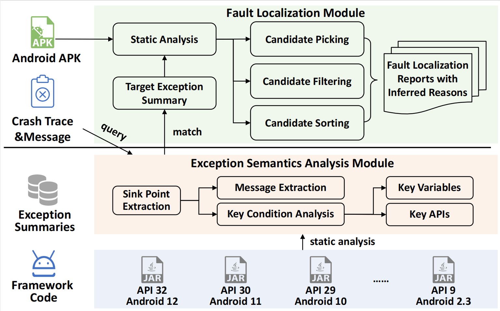
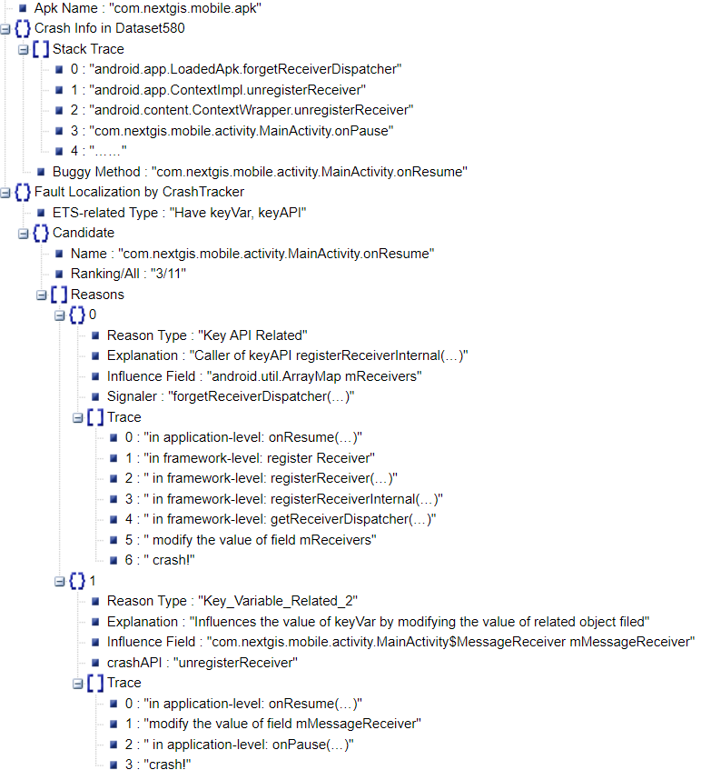
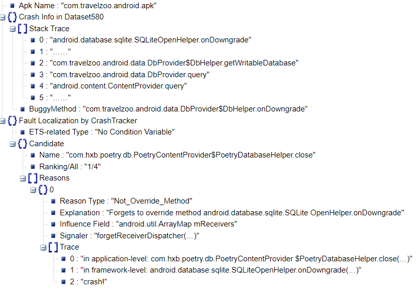
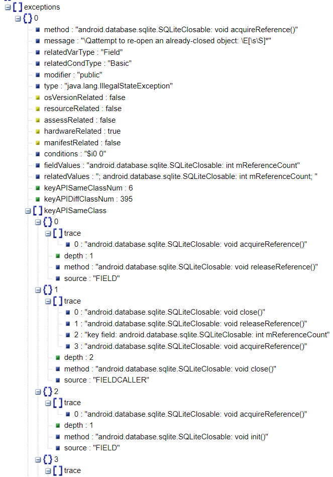

# CrashTracker: Locating Framework-specific Crashing Faults with Compact and Explainable Candidate Set

- [CrashTracker: Locating Framework-specific Crashing Faults with Compact and Explainable Candidate Set](#crashtracker-locating-framework-specific-crashing-faults-with-compact-and-explainable-candidate-set)
- [Paper Information](#paper-information)
  - [Name \& Abstract](#name--abstract)
  - [Artifact Project](#artifact-project)
- [CrashTracker Tool](#crashtracker-tool)
  - [Tool Overview](#tool-overview)
  - [Install Requirements](#install-requirements)
  - [Steps to run *CrashTracker*](#steps-to-run-crashtracker)
  - [CrashTracker.jar -h Arguments](#crashtrackerjar--h-arguments)
  - [Examples for CrashTracker's Report](#examples-for-crashtrackers-report)
  - [Examples for Exception-Thrown Summary (ETS)](#examples-for-exception-thrown-summary-ets)


# Paper Information

## Name & Abstract 

For ICSE 2023 paper：

> **Locating Framework-specific Crashing Faults with Compact and Explainable Candidate Set**

**Abstract:**

> Nowadays, many applications do not exist independently but rely on various frameworks or libraries. The frequent evolution and the complex implementation of APIs induce lots of unexpected post-release crashes. Starting from the crash stack traces, existing approaches either perform application-level call graph (CG) tracing or construct datasets with similar crash-fixing records to locate buggy methods. However, these approaches are limited by the completeness of CG or dependent on historical fixing records, and some of them only focus on specific manually modeled exception types. 
> 
> To achieve effective debugging on complex framework-specific crashes, we propose a code-separation-based locating approach that weakly relies on CG tracing and does not require any prior knowledge. Our key insight is that one crash trace with the description message can be mapped to a definite exception-thrown point in the framework, the semantics analysis of which can help to figure out the root causes of the crash-triggering procedure. Thus, we can pre-construct reusable summaries for all the framework-specific exceptions to support fault localization in application code. Based on that idea, we design the exception-thrown summary (ETS) that describes both the key variables and key APIs related to the exception triggering.  Then, we perform static analysis to automatically compute such summaries and make a data-tracking of key variables and APIs in the application code to get the ranked buggy candidates. In the scenario of locating Android framework-specific crashing faults, our tool CrashTracker exhibited an overall MRR value of 0.91 and outperforms the state-of-the-art tool Anchor with higher precision. It only provides a compact candidate set and gives user-friendly reports with explainable reasons for each candidate.

**Keywords:**

> Fault localization, Framework-specific Exception, Crash Stack Trace, Android Application


## Artifact Project
For more evaluation data in the paper, please refer to project [**CrashTracker-ArtifactForICSE** ](https://github.com/hanada31/CrashTracker-ArtifactForICSE).


# CrashTracker Tool 

## Tool Overview
<p align="left">

</p>

## Install Requirements

1. Python 3+ 
2. Java 1.8+
3. maven 3.6
4. Linux OS  (by default)
5. When using Windows, the separator should be changed from / to  \\ for part of commands. 

## Steps to run *CrashTracker* 

*Note: Only **English** characters are allowed in the path.*

The default usage is to perform **Android** framework-specific  fault localization using CrashTracker.jar. 

First，

```
# Initialize soot-dev submodule
git submodule update --init soot-dev

# Use -DskipTests to skip tests of soot (make build faster)
mvn -f pom.xml clean package -DskipTests

# Copy jar to root directory
cp target/CrashTracker.jar CrashTracker.jar

unzip android*.zip files in Files/ folder first.
unzip Files/android2.3.zip -d Files/android2.3/
unzip Files/android4.4.zip -d Files/android4.4/
unzip Files/android5.0.zip -d Files/android5.0/
unzip Files/android6.0.zip -d Files/android6.0/
unzip Files/android7.0.zip -d Files/android7.0/
unzip Files/android8.0.zip -d Files/android8.0/
unzip Files/android9.0.zip -d Files/android9.0/
unzip Files/android10.0.zip -d Files/android10.0/
unzip Files/android11.0.zip -d Files/android11.0/
unzip Files/android12.0.zip -d Files/android12.0/
```

Then, You have two choices:

   **Choice 1:** build and run *CrashTracker* to analyze single apk class Folder: 

```
# Run the tool
## for apk files (When using Windows, the separator should be changed from / to \)
java -jar CrashTracker.jar  -path M_application -name cgeo.geocaching-4450.apk -androidJar platforms  -crashInput Files/crashInfo.json  -exceptionInput Files -client ApkCrashAnalysisClient -time 30  -outputDir results/output

## for java libraries based on android framework files (When using Windows, the separator should be changed from / to \)
java -jar CrashTracker.jar  -path M_application -name facebook-android-sdk-905.jar -androidJar platforms  -crashInput Files/crashInfo.json  -exceptionInput Files -client JarCrashAnalysisClient -time 30  -outputDir results/output

you can config the -path, -name, -androidJar and -outputDir.
```

   **Choice 2:**  analyze apks under given folder with Python script:

```
Run the .py file.

# for apk files
python scripts/runCrashTracker-Apk.py  [apkPath] [resultPath] [target framework version] [strategy name]
e.g., python ./scripts/runCrashTracker-Apk.py  M_application results "no" "no"

# for java libraries based on android framework files
python scripts/runCrashTracker-Jar.py  [apkPath] [resultPath] [target framework version] [strategy name]
e.g., python ./scripts/runCrashTracker-Jar.py  M_application results "no" "no"

- [target framework version]: E.g., "2.3", "4.4", "6.0", "7.0", "8.0", "9.0", "10.0", "11.0", "12.0" or "no". Pick "no" if the crash triggering framework version is unknown.

- [strategy name]:  "NoCallFilter", "NoSourceType", "ExtendCGOnly",  "NoKeyAPI", "NoParaChain, "NoAppDataTrace", "NOParaChainANDDataTrace"or "no". Pick "no" to use the best/default strategy.
```

**(Optional)**

If you want to localize other versions of Android framework using CrashTracker.jar.

Extracting exception-thrown summary (ETS) for that framework is required before the localization!

```
# Use the following commands to analyze your framework files.
python scripts/runCrashTracker-framework.py [framework code location] [version] [outputDir]  

For example, if the sturcture of your files is as follows:
- CrashTrackerTool
    |-- framework
     |-- android5.0
        |-- a list of .class files extracted from android.jar files (do not use the android.jar file in the Android SDK, as they 			have empty implementation. Instead, extract android.jar files from your android phone or an emulator with the target 			version. Also, you can download from  https://github.com/hanada31/AndroidFrameworkImpl and unzip files)

run: 
    python scripts/runCrashTracker-framework.py  M_framework 2.3 ETSResults
```


## CrashTracker.jar -h Arguments

```
java -jar CrashTracker.jar -h

usage: java -jar CrashTracker.jar [options] [-path] [-name] [-androidJar] [-outputDir] [-crashInput] [-exceptionInput] [-client]
 -h                        -h: Show the help information.
 -client <arg>             -client 
 						   	   ExceptionInfoClient: Extract exception information from Android framework.
                               CrashAnalysisClient: Analysis the crash information for an apk.
                               JarCrashAnalysisClient: Analysis the crash information for an third party SDK.
                               CallGraphClient: Output call graph files.
                               ManifestClient: Output manifest.xml file.
                               IROutputClient: Output soot IR files.
 -name <arg>               -name: Set the name of the apk under analysis.
 -path <arg>               -path: Set the path to the apk under analysis.
 -crashPath <arg>          -crashInput: crash information file.
 -exceptionInput <arg>     -exceptionPath: exception file folder.
 -androidJar <arg>         -androidJar: Set the path of android.jar.
 -frameworkVersion <arg>   -frameworkVersion: The version of framework under analysis
 -strategy <arg>           -strategy: effectiveness of strategy "NoCallFilter", "NoSourceType", "ExtendCGOnly",  "NoKeyAPI", "NoParaChain, "NoAppDataTrace", "NOParaChainANDDataTrace"or "no"
 -time <arg>               -time [default:90]: Set the max running time (min).
 -outputDir <arg>          -outputDir: Set the output folder of the apk.

```


## Examples for CrashTracker's Report 

In folder results/output

- *Six types of reasons provided by CrashTracker.*

  - **a)**  **Key_API_Related**: Caller of *keyAPI*;
  - **b)**  **Key_Variable_Related_1**: Influences the value of *keyVar* by modifying the value of the passed parameters;
  - **c)**  **Key_Variable_Related_2**: Influences the value of *keyVar* by modifying the value of related object fields;
  - **d)**  **Executed_Method_1**: Not influence the *keyVar* but in crash trace; 
  - **e)**  **Executed_Method_2**: Not in the crash stack but has been executed;
  - **f)**   **Not_Override_Method**: Forgets to override the *Signaler* method.

- *The simplified report by CrashTracker for com.travelzoo.android.apk.*

  - As we can see, there is one reason for this buggy candidate. The crash is triggered when a framework API that throws an exception without any condition is invoked, and the override is required.

    


- *The simplified report by CrashTracker for com.nextgis.mobile.apk.*

  - As we can see, there are two types of reasons, explaining how the exception is triggered in both the application level (which influences the data passed to crashAPI) and framework level (which influences the exception-triggering condition in signaler).

  




## Examples for Exception-Thrown Summary (ETS)

In folder Files




